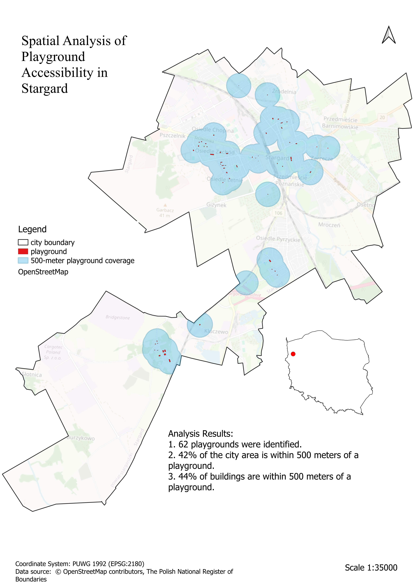

# Spatial Analysis of Playground Accessibility in Stargard

## Project Overview
This project presents an analysis of playground accessibility in Stargard, Poland, using PostgreSQL, PostGIS, and QGIS.
The aim of the analysis was to determine what proportion of the city's area and buildings is located within 500 meters of an existing playground.

## Technologies Used
- PostgreSQL
- PostGIS
- QGIS

## Data Used
The project uses data from the following sources:
- OpenStreetMap (playground locations and buildings)
- The Polish National Register of Boundaries (administrative boundaries of Stargard and Poland)

## Workflow
The main steps of the analysis were:
- Importing spatial data into a PostgreSQL database
- Selecting and preparing spatial layers (playgrounds, buildings, and city boundaries)
- Transforming coordinate reference systems to a common CRS (EPSG:2180)
- Creating spatial indexes to optimize query performance
- Generating 500-meter buffers around playgrounds
- Aggregating results and calculating accessibility indicators
- Visualizing the results in QGIS

## Results
A total of 62 playgrounds were identified in the OpenStreetMap data.
The analysis showed that 42% of the city's area is located within 500 meters of a playground.
Additionally, 44% of buildings are located within 500 meters of a playground.
The results indicate that some areas of the city may have limited access to playgrounds. This analysis can serve as a starting point for further research into the potential locations of new playgrounds to improve access to recreational spaces for residents.

## Final map

## Data Limitations
OpenStreetMap is a collaborative mapping project, so the completeness and accuracy of its data may vary. Some features, such as playgrounds or buildings, may not be fully mapped, and data quality depends on contributions from individual users.
Therefore, the results should be treated as an approximation of actual spatial accessibility.

## Author
Aleksandra Machałowska
